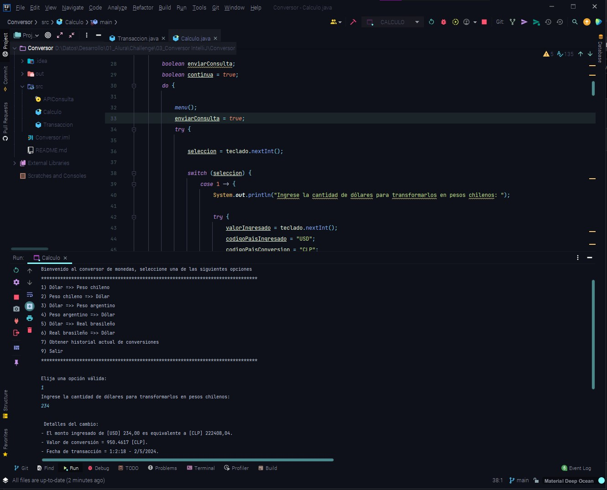

<h1> Conversor de moneda </h1> 

Pequeño programa realizado en Java, bajo el IDE IntelliJ Idea, que calcula el valor o transformación de monedas 
pre-establecidas mediante consola, consumiendo la API de [Exchange Rate API](https://www.exchangerate-api.com/).

Se implemento la librería Gson para poder realizar el consumo de la API.
Cada consulta válida genera un objeto y este es agregado a una lista, por lo tanto podemos 
generar un listado de las transccioneso o consultas realizadas durante la ejecución del programa.

Se incluyó la capturas de errores para un mejor y más fluido funcionamiento de este.
Al momento de terminar el programa generamos un archivo json, utilizando también, 
la librería gson, en el cual se van agregando las transacciones realizadas de manera histórica.

## Podemos ver la utilización de: </h2>
- Instancias de objetos.
- Utilización y recorrido de listas.
- Implementación de librerías externas (gson).
- Consumos de APIs.
- Captura de errores.
- Creación de archivos externos mediante la clase FileWriter.
- Interacción con el usuario por medio de la clase Scanner.
- Manipulación de hora y fecha a través de la clase LocalDateTime.

<h2> Captura de la vista en consola: </h2>

